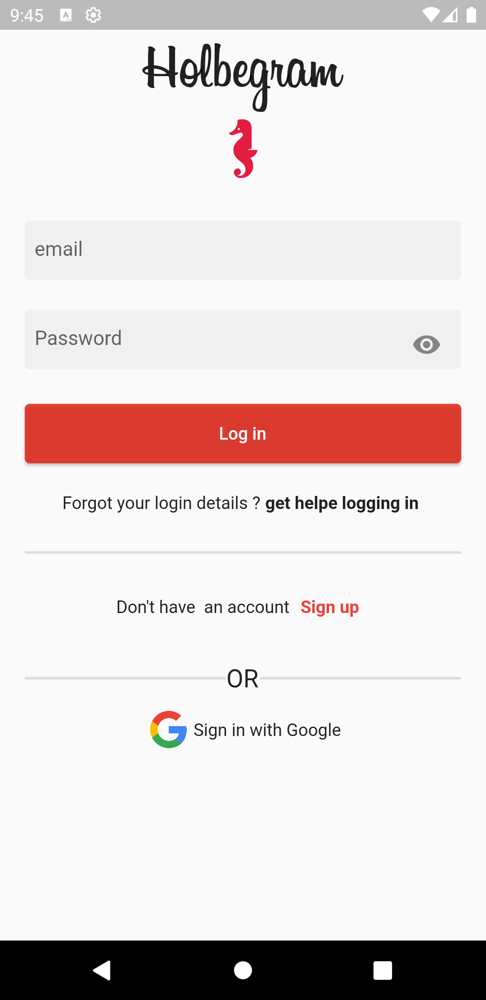
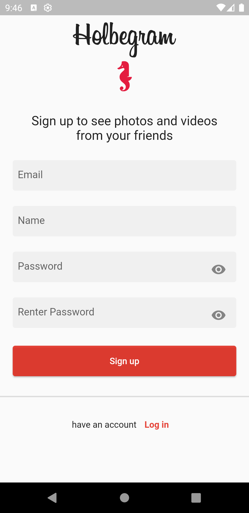
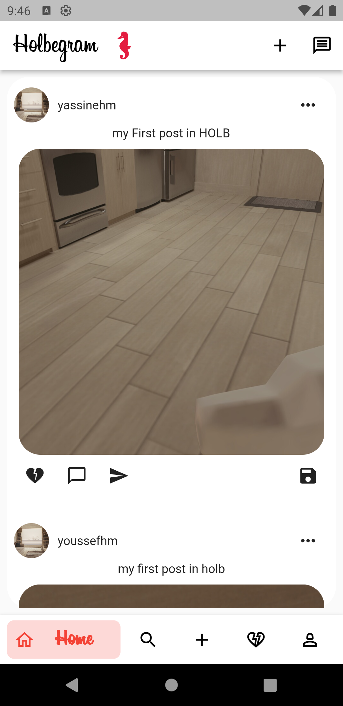
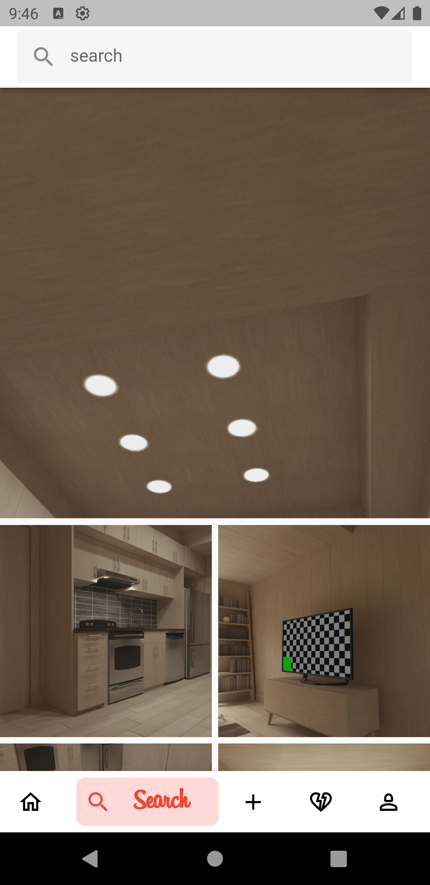
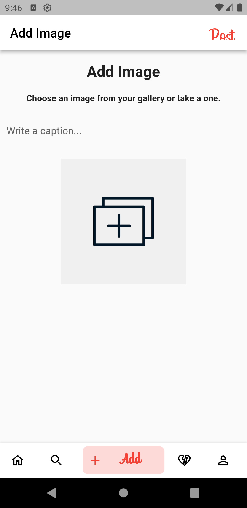
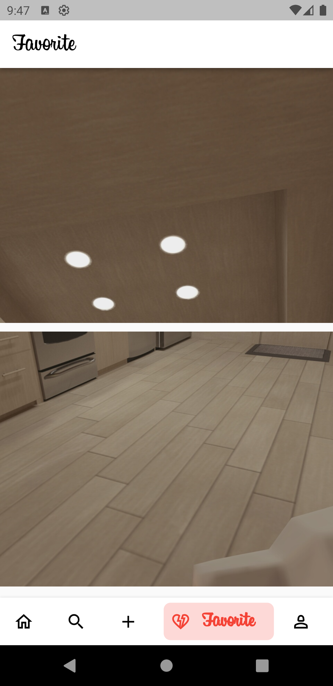
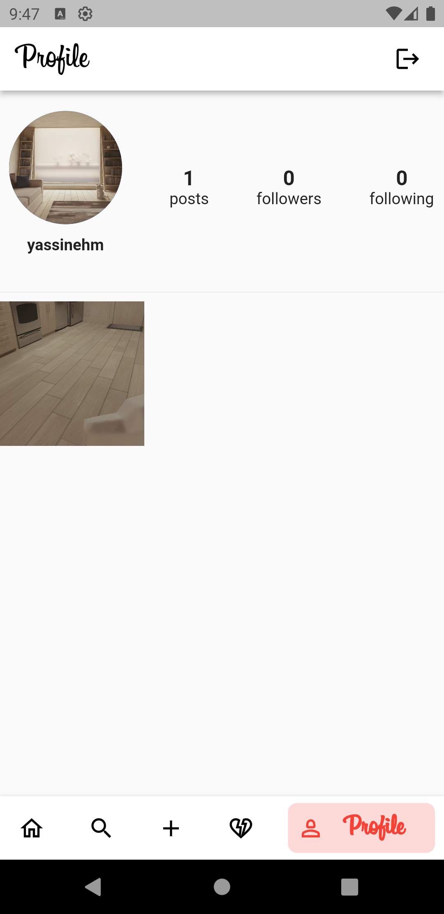

  
  <center><h1>Holbegram</h1>
  
  </center>
  
  

   


<br />
<!-- Introduction-->


## Introduction:
Holbegram is an innovative mobile application developed in collaboration with students from Holberton School using cutting-edge technologies like Flutter and Firebase. This project aims to create a dynamic and engaging platform for students, alumni, and mentors within the Holberton School community.

Key Features:

1) Profile Management: Users can create and customize their profiles, showcasing their achievements, skills, and projects completed during their Holberton School journey.

2) Social Interaction: Holbegram fosters a sense of community by providing a space for students and alumni to connect, share experiences, and collaborate on projects. Users can follow each other, endorse skills, and participate in discussions.

3) Flutter-Powered UI: The application boasts a sleek and intuitive user interface created with Flutter, ensuring a smooth and consistent experience across iOS and Android devices.

4) Firebase Integration: Leveraging the power of Firebase, Holbegram ensures secure user authentication, real-time data synchronization, and efficient cloud storage for user-generated content.


## :wrench: Instalation:
Clone the repo
```
git clone git@github.com:majdideveloper/holbertonschool-holbegram.git
```

## Libraries & Tools Used.
- [provider](https://pub.dev/packages/provider/install)
- [http](https://pub.dev/packages/http)
- [flutter_spinkit](https://pub.dev/packages/flutter_spinkit)
- [animated_text_kit](https://pub.dev/packages/animated_text_kit)


## App Screenshot





## Video
[Video Youtube](https://youtu.be/visuSUWA7B0)

